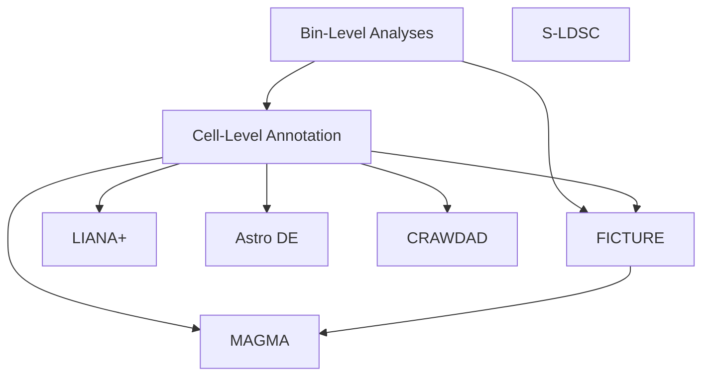

## Overall workflow

Major pieces of the Visium HD analysis are represented as nodes in the below
graph. Each such node has its own code directory, described later in this
file.

## Analysis components

### Bin-level analysis

Location [code/15_HD_bin_level](https://github.com/LieberInstitute/Habenula_Visium/tree/devel/code/15_HD_bin_level)

Early in the analysis workflow, we worked with the 8um bin-level data. The main
goals were to perform QC (used later in the cell-level analyses) and compute
spatially variable genes, a necessary prerequisite for cell-level clustering.

### Cell-level analysis

Location [code/16_HD_cell_level](https://github.com/LieberInstitute/Habenula_Visium/tree/devel/code/16_HD_cell_level)

