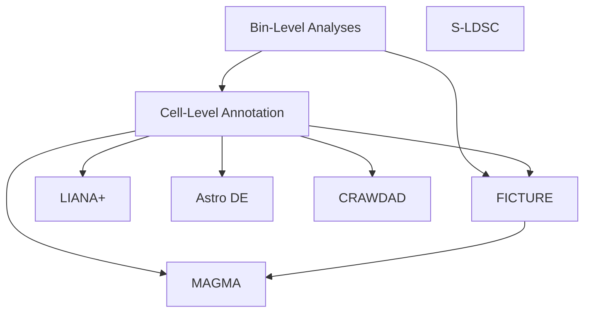

## Overall workflow

Major pieces of the Visium HD analysis are represented as nodes in the below
graph. Each such node has its own code directory, described later in this
file.

## Analysis components

### Bin-level analysis

Location [code/15_HD_bin_level](https://github.com/LieberInstitute/Habenula_Visium/tree/devel/code/15_HD_bin_level)

Early in the analysis workflow, we worked with the 8um bin-level data. The main
goals were to perform QC (used later in the cell-level analyses) and compute
spatially variable genes, a necessary prerequisite for cell-level clustering.

### Cell-level analysis

**Location [code/16_HD_cell_level](https://github.com/LieberInstitute/Habenula_Visium/tree/devel/code/16_HD_cell_level)**

Here we perform cell-level clustering with `Banksy`, then annotate cell types by
registering against the snMultiome clusters. There are also various plots for
internal use and the manuscript [here](https://github.com/LieberInstitute/Habenula_Visium/tree/devel/code/16_HD_cell_level/03_various_plots).

### Cell-cell communication with `LIANA+`

**Location [code/17_HD_liana](https://github.com/LieberInstitute/Habenula_Visium/tree/devel/code/17_HD_liana)**

Here we quantified ligand-receptor interactions among annotated cells types with
`LIANA+`.

### MHb vs LHb astrocyte differential expression

**Location [code/18_HD_astro_DE](https://github.com/LieberInstitute/Habenula_Visium/tree/devel/code/18_HD_astro_DE)**

We asked whether astrocytes roughly in the MHb had transcriptional differences
with astrocytes roughly in the LHb. Noticing that MHb neuron transcriptional
profiles were present among astrocytes in the spatial vicinity in our ordinary
cell-level data, we initially restricted analysis to only use nuclei in
[code/18_HD_astro_DE/01_prep_nuclear_data](https://github.com/LieberInstitute/Habenula_Visium/tree/devel/code/18_HD_astro_DE/01_prep_nuclear_data). Then we performed the full
DE analysis in [code/18_HD_astro_DE/02_astro_DE](https://github.com/LieberInstitute/Habenula_Visium/tree/devel/code/18_HD_astro_DE/02_astro_DE).

### Spatial arrangement of cell types with `CRAWDAD`

**Location [code/19_HD_crawdad](https://github.com/LieberInstitute/Habenula_Visium/tree/devel/code/19_HD_crawdad)**

To quantify colocalization or dispersion of cell types, we used `CRAWDAD`.
Each sample was initially processed independently, and to form dataset-wide
trends we aggregated results in the final script, [16_crawdad_plot.R](https://github.com/LieberInstitute/Habenula_Visium/blob/devel/code/19_HD_crawdad/16_crawdad_plot.R).

### Finding spatial factors with `FICTURE`

**Location [code/20_HD_ficture](https://github.com/LieberInstitute/Habenula_Visium/tree/devel/code/20_HD_ficture)**

We ran `FICTURE` to find spatial factors using different sets of input data:

- [All 2um bins, without batch correction](https://github.com/LieberInstitute/Habenula_Visium/tree/devel/code/20_HD_ficture/02_all_bin_normalized)
- [All 2um bins, with batch correction](https://github.com/LieberInstitute/Habenula_Visium/tree/devel/code/20_HD_ficture/02_all_bin_normalized). We used `k = 8` results for this in the manuscript.
- [Just extracellular bins, with batch correction](https://github.com/LieberInstitute/Habenula_Visium/tree/devel/code/20_HD_ficture/04_extracellular). We used `k = 17` results for this in the manuscript.

### Enrichment of psychiatric and substance-use risk with `MAGMA`

**Location [code/21_HD_MAGMA](https://github.com/LieberInstitute/Habenula_Visium/tree/devel/code/21_HD_MAGMA)**

For the Habenula Atlas project as a whole, we wanted to check enrichment of
our marker genes for risk for psychiatric and substance-use disorders. We
found markers for clusters in several datasets:

- **Visium HD cell-level data**, located [here](https://github.com/LieberInstitute/Habenula_Visium/tree/devel/code/21_HD_MAGMA/01_cellular), corresponding to analysis done [here](https://github.com/LieberInstitute/Habenula_Visium/tree/devel/code/16_HD_cell_level)
- **Visium HD extracellular cell-level data**, located [here](https://github.com/LieberInstitute/Habenula_Visium/tree/devel/code/21_HD_MAGMA/02_extracellular_cells)
- **Visium HD extracellular `FICTURE` results at `k = 17`**, located [here](https://github.com/LieberInstitute/Habenula_Visium/tree/devel/code/21_HD_MAGMA/03_extracellular_ficture), corresponding to analysis done [here](https://github.com/LieberInstitute/Habenula_Visium/tree/devel/code/20_HD_ficture/04_extracellular)
- **Visium HD all-bin `FICTURE` results at `k = 8`**, located [here](https://github.com/LieberInstitute/Habenula_Visium/tree/devel/code/21_HD_MAGMA/04_all_bin_ficture), corresponding to analysis done [here](https://github.com/LieberInstitute/Habenula_Visium/tree/devel/code/21_HD_MAGMA/04_all_bin_ficture)
- **snMultiome cell types**, located [here](https://github.com/LieberInstitute/Hb_multiome/tree/master/code/10_MAGMA/RNA), corresponding to analysis done [here](https://github.com/LieberInstitute/Hb_multiome/tree/master/code/05_Clustering_ARCr)

### Enrichment of psychiatric and substance-use risk with `s-LDSC`

**Location [code/22_HD_LDSC](https://github.com/LieberInstitute/Habenula_Visium/tree/devel/code/22_HD_LDSC)**

We checked whether the genomic regions present among differentially accessible
regions (DARs) in the snMultiome data were enriched for risk for psychiatric and
substance-use disorders. For the DAR analysis prior to s-LDSC, check [here](https://github.com/LieberInstitute/Hb_multiome/tree/master/code/15_DARs).
