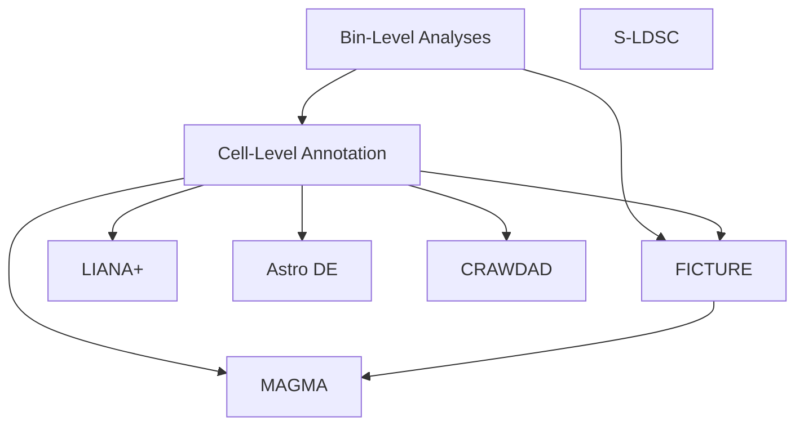

```mermaid
flowchart TD
    bin_level["Bin-Level Analyses"]
    cell_annotation["Cell-Level Annotation"]
    ficture["FICTURE"]
    magma["MAGMA"]
    liana["LIANA+"]
    astro_de["Astro DE"]
    crawdad["CRAWDAD"]
    ldsc["S-LDSC"]

    bin_level --> cell_annotation
    bin_level --> ficture
    cell_annotation --> ficture
    cell_annotation --> magma
    ficture --> magma
    cell_annotation --> liana
    cell_annotation --> astro_de
    cell_annotation --> crawdad
```
