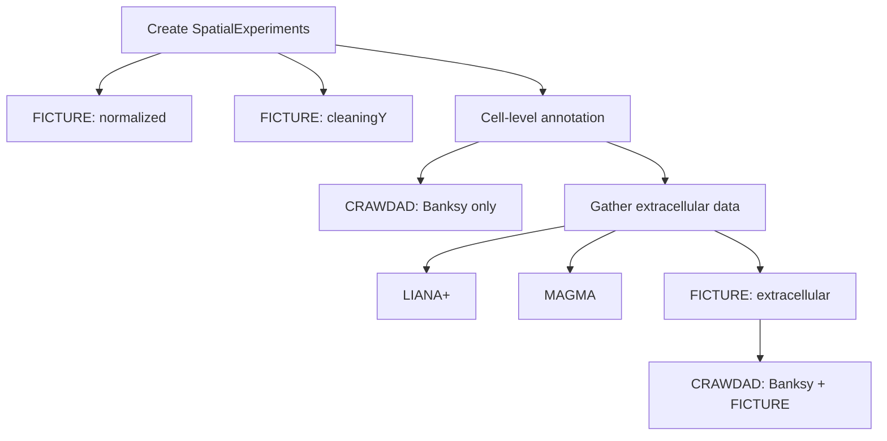

# Visium HD Analysis Workflow

This document aims to document the steps required to analyze the Visium HD data
for this project. As the analysis steps and their dependencies became complex,
this document was created in favor of `run_all_hd.sh`, which was complex to 
maintain and difficult to visualize/read.

The analysis workflow is described here first as a set of high-level steps, each
composed of potentially several R, Python, or shell scripts that are enumerated
later.

## High-Level Workflow

## Lower-Level Scripts

### Create SpatialExperiments

8um bin-level scripts under `code/10_HD_bin_level`:

- `01_build_spe.sh`
- `02_QC.sh`
- `07_split_spe.sh`

Cell-level scripts under `code/09_HD_cell_level`:

- `01_bin2cell.sh`
- `02_build_spe_raw.sh`
- `03_build_spe_QC.sh`
- `03_new_sample_report.R`
- `04_HVG.sh`
- `17_split_spe.sh`

### FICTURE: normalized

Scripts under `code/10_HD_bin_level/ficture_harmony`:

Main FICTURE steps:

- `01_build_spe.sh`
- `02_normalized_input.sh`
- `03_ficture_run.sh`
- `03_ficture_plot.sh`
- `04_spatula_join.sh`
- `09_bin_level_merge_norm.sh`

Spatial registration:

- `10_registration_wrapper_norm.sh`
- `11_cor_heatmap_norm.sh`

### FICTURE: cleaningY

Scripts under `code/10_HD_bin_level/ficture_harmony`:

Main FICTURE steps:

- `08_batcheffect_lm.sh`
- `08_batcheffect_com.sh`
- `08_reprepareinput_ficture.sh`
- `08_rerun_ficture.sh`
- `03_ficture_plot_cleany.sh`
- `09_get_ficture_clusters.sh`
- `09_bin_level_merge_cleany.sh`

Spatial registration:

- `10_registration_wrapper_cleany.sh`
- `11_cor_heatmap_cleany.sh`

### Cell-level annotation

Finding SVGs — scripts under `code/10_HD_bin_level`:

- `03_rasterize.sh`
- `04_nnSVG.sh`
- `05_gather_variable_genes.sh`

Running Banksy — scripts under `code/09_HD_cell_level`:

- `05_banksy_embedding.sh`
- `06_banksy_clustering.sh`

Spatial registration — scripts under `code/09_HD_cell_level/registration_banksy`:

- `01_registration_wrapper.sh`
- `02_cor_heatmap.sh`
- `06_deciding_k.sh`
- `08_annotation.sh`

### CRAWDAD: Banksy only

Scripts under `code/09_HD_cell_level`:

- `07_xenium_genes.sh`
- `14_crawdad_prep.sh`
- `15_crawdad_run.sh`
- `16_crawdad_plot.sh`

### LIANA+

NMF/bivariate-score-based LIANA+, with scripts under `code/10_HD_bin_level/liana`:

(TODO: the final workflow is subject to change)

- `12_preprocess_anndata.sh`
- `14_0_liana_prepare_inputs.sh`
- `14_2_LIANA+_preprocess.sh`
- `14_3_LIANA+_preprocss_extracellular.sh`
- `15_1_LIANA+_cell.sh`
- `15_1_LIANA+_extracell.sh`
- `16_LIANA+_cell_multidonor.sh`
- `16_LIANA+_cell_multidonor_extracell.sh`
- `17_LIANA+_cell_type_spcific.sh`
- `18_LIANA+_NMF.sh`
- `19_GO_enrichment.sh`

Inflow-score-based LIANA+, with scripts under [TODO]:

(TODO)

### MAGMA

MAGMA on cellular results, with scripts under `code/09_HD_cell_level/MAGMA`:

- `05_mean_ratio.sh`
- `06_MAGMA_mean_ratio.sh`
- `07_heatmap_mean_ratio.sh`
- `08_gene_level_results.sh`

Extracellular MAGMA (scripts under `code/09_HD_cell_level/MAGMA/extracellular`):

- `01_to_spe.sh`
- `02_prep_spe.sh`
- `03_mean_ratio.sh`
- `04_MAGMA_first_two.sh`
- `05_gene_set_analysis.sh`
- `06_gene_level_results.sh`
- `07_heatmap.sh`

### Gather extracellular data

Main code for preparing the extracellular SPE, with scripts under `code/10_HD_bin_level/cell_environment`:

- `01_explore_distances.sh`
- `02_plot_occupation.sh`
- `03_extracellular_bins.sh`
- `04_prep_spe.sh`

Helper scripts for preparing cellular and extracellular data for LIANA+:

- `15_export_tissue.sh`
- `16_liana_adatas.sh`

### FICTURE: extracellular

Scripts under `code/10_HD_bin_level/cell_environment`:

- `05_cleaningY_chunked.sh`
- `06_ficture_input.sh`
- `07_ficture_run.sh`
- `08_ficture_plot.sh`
- `09_spatula_join.sh`

### CRAWDAD: Banksy + FICTURE

Scripts under `code/10_HD_bin_level/cell_environment`:

- `17_prep_ficture_crawdad.sh`
- `18_run_ficture_crawdad.sh`
- `19_plot_ficture_crawdad.sh`
